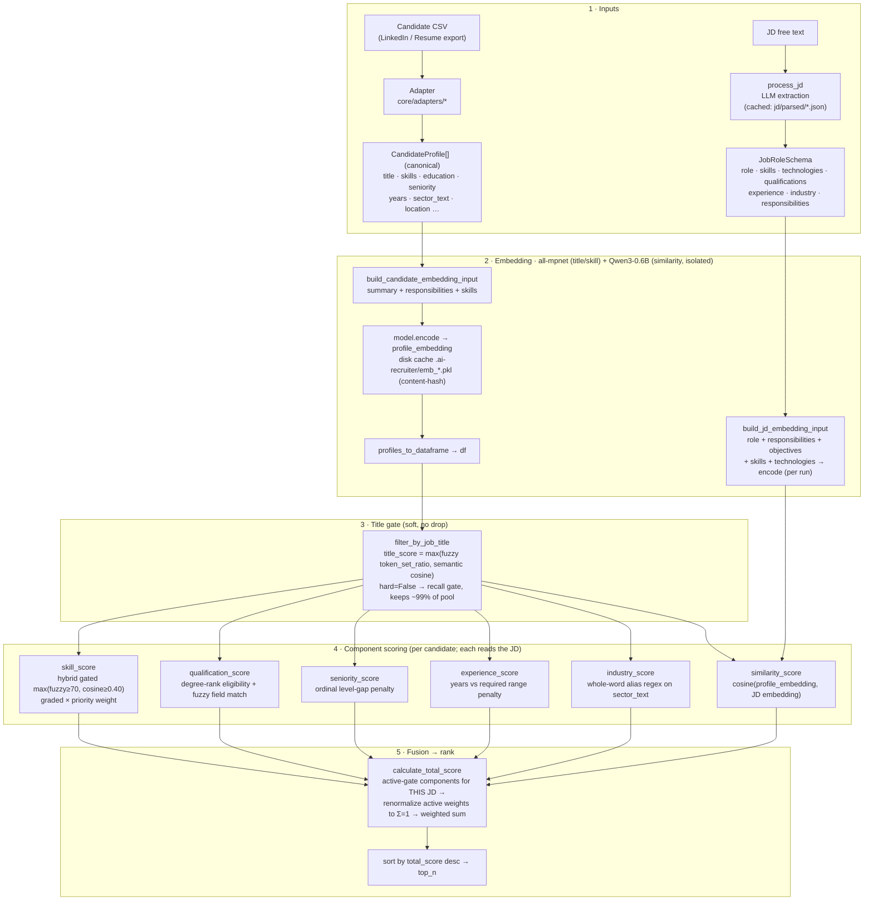
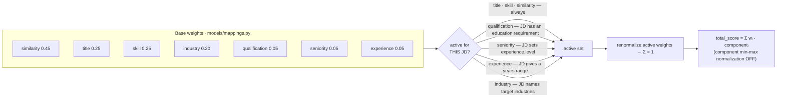

# Pipeline — Current State

A detailed, current-state map of the candidate scoring/ranking pipeline: the end-to-end flow,
every scoring component, and how the final rank is produced.

> **Scope:** this file describes the pipeline **as it is today**. For *how it got here* (the
> baseline→champion journey, ablations, corrections) see `evals/pipeline_improvement_report.md`.
> For the module map, limitations and future work see [`ARCHITECTURE.md`](../ARCHITECTURE.md);
> for settled design calls see [`docs/DECISIONS.md`](./DECISIONS.md).

---

## End-to-end flow

> Every component scorer in stage 4 consumes the parsed `JobRoleSchema` (the JD requirements)
> alongside the candidate `df`. The title gate is **soft** by default (`hard=False`) — it scores
> but does not drop, so downstream components see the whole pool. Optional hard filters
> (`filter_by_skills`, `filter_by_qualifications`) exist but are **off** by default.

## The weighted fusion (stage 5)

The final score is a weighted sum of only the components that are **active** for the given JD,
with the active weights renormalized to sum to 1 (so `total_score` stays comparable across JDs
that supply different signals).

---

## Components at a glance

| component | weight | method | active when | code |
|---|---:|---|---|---|
| **similarity** | 0.45 | bi-encoder cosine between the candidate profile embedding and the JD embedding (**`Qwen3-Embedding-0.6B`**, isolated to this component; instruction-prompted, fp16, `max_seq_length=1024`) | always | `core/scoring.py` · `core/embedding.py` · [spec](./specs/bi-encoder-upgrade.md) |
| **title** | 0.25 | hybrid `max(fuzzy token_set_ratio, semantic cosine)`, **soft** (scores, never drops) | always | `core/filtering.py` |
| **skill** | 0.25 | hybrid per-channel **gated** `max(fuzzy≥70, cosine≥0.40)`, graded & priority-weighted over JD skills + technologies | always | `core/matching.py` · `core/scoring.py` · [spec](./specs/hybrid-skill-matching.md) |
| **industry** | 0.20 | whole-word **alias-regex** presence in the candidate's `sector_text`, priority-weighted | JD names industries | `core/scoring.py` · `core/industry_normalization.py` |
| **qualification** | 0.05 | degree-rank eligibility (candidate degree ≥ required) + fuzzy field match, priority-weighted | JD has an education requirement | `core/matching.py` |
| **seniority** | 0.05 | ordinal level-gap penalty (under-qualification penalized more than over) | JD sets `experience.level` | `core/scoring.py` |
| **experience** | 0.05 | years-of-experience vs the JD's `[min,max]` range, gentle over-penalty | JD gives a years range | `core/scoring.py` |
| **language** | 0.15 | explicit presence, priority-weighted normalized-exact (aliases Tagalog↔Filipino); T3-measured general-language gain | JD names languages | `core/scoring.py` · `core/language_normalization.py` · [spec](./specs/language-scoring.md) |
| **location** | 0.05 | country > city hierarchy (matching **or omitted** city = full credit; confirmed different city partial), UAE aliasing; **product-motivated** weight (reverse-match de-leaked for location) | JD names a city/country | `core/scoring.py` · `core/location_normalization.py` · [spec](./specs/location-scoring.md) |
| **attrition** | 0.005 | median completed-permanent tenure; current/contract roles excluded; early-career floor; product tie-breaker | position history available | `core/scoring.py` · `core/positions.py` |
| **experience relevance** | 0.015 | tenure-weighted relevant vs adjacent role-title mix; product tie-breaker | position history available | `core/scoring.py` · `core/positions.py` |
| **education relevance** | 0.005 | soft HR/business-degree + HR-certification bonus, never a gate; product tie-breaker | candidate-side signal | `core/scoring.py` |

Weights are the **base**; `calculate_total_score` renormalizes whichever components are active for
the JD so they sum to 1. A candidate/JD signal that is missing resolves to a neutral 0.5 and (for the
optional components) is dropped from the blend rather than penalizing the JD. `language` carries the
T3-measured weight **0.15**; `location` carries a small **product-motivated** weight (0.05). Attrition,
experience relevance, and education relevance use tiny product tie-breaker weights after their standalone
T3 sweeps rejected larger measured weights.

## Tunable knobs

| knob | default | where |
|---|---|---|
| embedding model | `all-mpnet-base-v2` (title/skill) · `Qwen3-Embedding-0.6B` (similarity, isolated — `models/mappings.py:similarity_model_config`) | pipeline / runner |
| `title_mode` | `hybrid` (soft, `title_hard=False`) | `core/filtering.py` + entry points |
| `skill_mode` | `hybrid` | `core/scoring.py` + entry points |
| `skill_semantic_threshold` (cosine floor) | `0.40` | `models/mappings.py` |
| skill fuzzy floor (`match_threshold`) | `70` | `core/scoring.py` |
| component weights | `title .25 / skill .25 / qualification .05 / similarity .45 / seniority .05 / experience .05 / industry .20 / language .15 / location .05 / attrition .005 / experience-relevance .015 / education-relevance .005` | `models/mappings.py` |
| `normalize_components` (per-component min-max) | **OFF** | `core/scoring.py` |
| `filter_by_skills` / `filter_by_qualifications` (hard filters) | **OFF** | `core/scoring.py` |

## Entry points (all share the same scorer order)

- **`core/pipeline.py` → `run_pipeline`** — general orchestrator (any adapter/dataset).
- **`evals/runner.py` → `rank_candidates`** — used by the eval harness and `scripts/calibrate_weights.py`.
- **`scripts/run_hr_assistant.py` → `score_pool`** — the real 145-candidate HR-Assistant run.

They differ only in wiring; the scoring is the shared functions in `core/scoring.py` +
`core/filtering.py`, so a change to a scorer applies uniformly.

## Data contracts

- **Adapters** (`core/adapters/*`) map any source schema → canonical
  `models/candidate.CandidateProfile`. Scorers read **only** canonical fields, never raw columns —
  adding a dataset means adding an adapter, not touching scorers.
- **JD store** — `core.jd_extraction.process_jd(jd, cache_path=…)` caches the parsed
  `JobRoleSchema` to `jd/parsed/*.json`; those files are editable, so JD properties can be tweaked
  and re-run with no re-extraction.
- **Embedding cache** — candidate embeddings are content-hash keyed at `.ai-recruiter/emb_*.pkl`, so
  unchanged inputs are never re-encoded. Skill embeddings (for the hybrid matcher) are built in-memory
  per run and not persisted (cheap; see the [skill spec](./specs/hybrid-skill-matching.md)).

## See also

- **How it got here** (baseline → champion, ablations, eval corrections) → `evals/pipeline_improvement_report.md`
- **Module map, limitations, planned improvements** → [`ARCHITECTURE.md`](../ARCHITECTURE.md)
- **Settled design decisions** → [`docs/DECISIONS.md`](./DECISIONS.md)
- **Open work** → [`docs/BACKLOG.md`](./BACKLOG.md)
- **Hybrid skill matcher spec** → [`docs/specs/hybrid-skill-matching.md`](./specs/hybrid-skill-matching.md)
