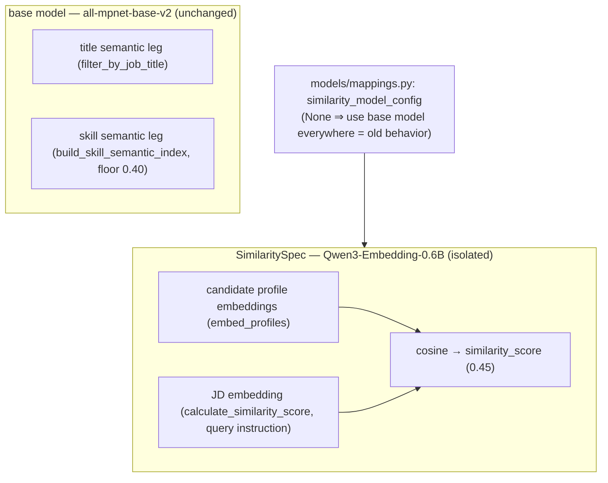

# Spec — Similarity Bi-encoder Upgrade (all-mpnet → Qwen3-Embedding-0.6B)

| | |
|---|---|
| **Status** | ✅ Shipped (2026-07-13) — **product-motivated**, eval-cautious |
| **Type** | Model swap inside the existing `similarity_score` component (isolated; no new component) |
| **Decision** | `docs/DECISIONS.md` → "Similarity embedding: all-mpnet → Qwen3-Embedding-0.6B" |
| **Config** | `models/mappings.py` → `similarity_model_config` (set to `None` to revert to all-mpnet) |
| **Tests** | `tests/test_eval_regression.py` (EXCEPTION #5, guards the Qwen champion) · full suite 105 pass |
| **Baseline** | `evals/baseline_linkedin.json` |

---

## 1. Summary

Swap **only** the 0.45-weight `similarity_score` encoder from `all-mpnet-base-v2` to
**`Qwen/Qwen3-Embedding-0.6B`** — title and skill semantic legs keep all-mpnet. The new model is
instruction-prompted (JD = query), loaded fp16 with `max_seq_length = 1024`. Adopted **product-motivated**
(all-mpnet truncates ~44 % of the LinkedIn profiles at its 384-token cap, and future JDs will exceed it
too), explicitly **not** as an eval-proven ranking gain: the single short gold JD cannot measure the
long-context benefit. The change is **isolated** (Option B) behind one config dict so it is attributable
and reversible.

## 2. Problem

`similarity_score` (weight **0.45** — the pipeline's single heaviest signal) is a bi-encoder cosine
between the candidate profile embedding and the JD embedding. The encoder was `all-mpnet-base-v2`, whose
`max_seq_length` is **384 tokens**. Measured on the 145-candidate LinkedIn pool
(`build_candidate_embedding_input` text, all-mpnet tokenizer):

| statistic | tokens |
|---|---:|
| median | 342 |
| mean | 410 |
| p90 | 872 |
| p95 | 1030 |
| max | 1177 |
| **> 384 (truncated)** | **64 / 145 = 44.1 %** |
| > 512 | 33.1 % |
| > 1024 | 6.9 % |

So all-mpnet silently drops content for ~44 % of candidates — for the longest profiles, two-thirds of
the text. `all-mpnet-base-v2` (2021) is also short-context by design; modern encoders offer 8k–32k
context. As real client JDs grow past 384 tokens (the current gold JD is 346, but reverse-match JDs
already reach 380–476), the truncation will worsen on the JD side too.

## 3. Goals / Non-goals

**Goals**
- Give `similarity_score` an encoder that captures the full profile (and future long JDs) instead of
  truncating at 384 tokens.
- Keep the change **isolated** to `similarity_score`, **behind a config**, and **backward compatible**
  (all pre-existing tests pass; `None` reverts to all-mpnet everywhere).
- Surface truncation as an ongoing **signal** (log it whenever inputs exceed the cap).
- Adopt only if it **clears every regression floor** on the honest eval set.

**Non-goals**
- No weight change (`similarity_score` stays 0.45).
- **Not** a cross-encoder / re-ranker — that is the separate, still-parked **M1** backlog item.
- Do **not** move the title/skill semantic legs to the new model in this change (that needs the
  all-mpnet-calibrated `skill_semantic_threshold = 0.40` re-tuned first — a separate, measured step).
- Not claiming an eval-proven ranking gain (see §7 — the n=1 short gold JD is eval-blind to long context).

## 4. Design

### Isolation (Option B)

The embedding model is a **shared backbone**: one `SentenceTransformer` fed `similarity_score`, the
title semantic leg, and the skill semantic leg. A naive full swap would (a) change three components at
once, confounding attribution, and (b) break the shipped hybrid-skill matcher, whose 0.40 cosine floor
was calibrated to all-mpnet's compressed skill-cosine distribution. So the new model is threaded **only**
to the candidate/JD profile embeddings via an optional `SimilaritySpec`; when absent, everything uses the
base model (pre-upgrade behavior).



### `SimilaritySpec` + builder (`core/embedding.py`)

`build_similarity_spec(config, base_model)` loads the model with the right device/dtype/seq-length and
returns a `SimilaritySpec(model, model_key, query_instruction, doc_instruction, batch_size)`; `None`
config → `None` spec → similarity uses `base_model`. The scorers apply the spec:
- `embed_profiles(..., model_key=…, doc_instruction=…, batch_size=…)` — candidate (document) side.
- `calculate_similarity_score(..., query_instruction=…)` — JD (query) side.

### Instruction prompting (query/document asymmetry)

Qwen3-Embedding is instruction-tuned; unprompted it barely discriminates (cos("HR Assistant",
"warehouse forklift operator") ≈ 0.51). Our `similarity_score` is a retrieval framing — the JD is the
**query**, candidates are **documents** — so the champion applies a query instruction to the **JD only**:

```
Instruct: Given a job description, retrieve candidate profiles that best match the role.\nQuery:
```

Candidates get no prefix (document side). The instruction is an A/B knob (§7 shows it is worth +0.04
gold NDCG@10 for Qwen).

### Memory / device handling (16 GB Apple M2 Pro, MPS, PyTorch 2.7.1)

- **`max_seq_length = 1024`** — Qwen's native 32k context OOM'd on MPS when encoding long profiles;
  1024 is memory-safe and still **2.7× all-mpnet's 384** (only 6.9 % of profiles exceed it).
- **fp16** (`--sim-dtype fp16`, applied post-load via `.half()`) halves MPS memory and is precision-
  neutral here (fp16 cos 0.513 vs fp32 0.512). `calculate_similarity_score` casts the JD vector back to
  float32 so the cosine matmul matches the float32 cached candidate vectors.
- **`batch_size = 16`** caps peak activation memory during the encode.

### Truncation logging (`core/embedding.py:log_truncation`)

Before encoding (candidates) and before the JD encode, the input token lengths are compared to the
model's `max_seq_length`; if any exceed it, a `WARNING` is emitted, e.g.:

```
[truncation] 10/145 candidate profiles exceed max_seq_length=1024 (longest=1220 tokens) —
content beyond the cap is dropped from the embedding
```

It runs **before** the embedding cache check so the signal fires every run (not only on cache miss). The
JD side is silent when under the cap (the gold JD is 346 tokens).

### Cache safety

The candidate embedding cache key previously hashed only the profile texts — **model-blind**, so
swapping encoders could return stale or wrong-dimension vectors. The key now folds in `model_key`
(model + instruction + seq-length) and entry points use per-model cache paths
(`.ai-recruiter/emb_linkedin_v2_<slug>.pkl`). A **NaN guard** raises if an encoder emits NaN embeddings
(would otherwise silently corrupt every ranking — see §6, Jasper).

### Configuration knobs

| knob | where | default | meaning |
|---|---|---|---|
| `similarity_model_config` | `models/mappings.py` | Qwen dict | `None` → all-mpnet everywhere; dict → isolated similarity model |
| `model_name` | config | `Qwen/Qwen3-Embedding-0.6B` | any `SentenceTransformer` id |
| `query_instruction` | config | JD-retrieval prompt | prepended to the JD; `None` = off |
| `doc_instruction` | config | `None` | prepended to candidate profiles |
| `dtype` | config | `fp16` | `auto` \| `fp32` \| `fp16` \| `bf16` |
| `device` | config | `None` (auto = MPS) | e.g. `cpu` for encoders that NaN on MPS |
| `max_seq_length` | config | `1024` | sequence cap (memory; > all-mpnet's 384) |
| `batch_size` | config | `16` | encode batch (peak memory) |

The ablation harness `scripts/run_eval.py` exposes the same as flags: `--embedding-model`,
`--sim-query-instruction`, `--sim-doc-instruction`, `--sim-dtype`, `--sim-device`, `--sim-max-seq`,
`--sim-batch-size`.

## 5. Integration points

| file | change |
|---|---|
| `models/mappings.py` | `similarity_model_config` (champion Qwen dict; `None` reverts) |
| `core/embedding.py` | `SimilaritySpec`, `build_similarity_spec`, `log_truncation`, model-aware cache key, NaN guard, `batch_size`/`doc_instruction` on `embed_profiles` |
| `core/scoring.py` | `calculate_similarity_score`: `query_instruction`, JD truncation log, fp16→float32 cast |
| `evals/runner.py` | re-exports `SimilaritySpec` from core; `rank_candidates` / `evaluate_cases` take `sim_spec` |
| `core/pipeline.py` | `run_pipeline`: `similarity_model_config` (default = champion), isolated embed + similarity |
| `scripts/run_hr_assistant.py` | `score_pool(sim_spec=…)`, `main` builds the spec, per-model cache |
| `scripts/run_eval.py` | `--embedding-model` + `--sim-*` flags, per-model cache, embedding meta in `--out` |
| `tests/test_eval_regression.py` | builds the Qwen champion `sim_spec`; **EXCEPTION #5**; floors unchanged |

## 6. Model selection

Candidate generation used the MTEB leaderboard (filtered by model type) plus model-card BEIR; the
**decision metric is our own gold NDCG@10**. Latency is not binding (145 title-gated candidates), but the
16 GB M2 Pro caps model size, so 7–8B rerankers were excluded up front.

| model | verdict |
|---|---|
| **Qwen3-Embedding-0.6B** | **adopted.** 596M, apache-2.0, 1024-dim, 95 % zero-shot (trustworthy), eng-MTEB #24 (70.47), BEIR 55.52. Runs on MPS in fp16. |
| Jasper-Token-Compression-600M | **rejected.** Higher raw eng-MTEB (#2, 74.75) but **48 % zero-shot** (benchmark contamination) and **NaNs on Apple MPS in every dtype** (fp32/fp16/bf16) and with `PYTORCH_ENABLE_MPS_FALLBACK=1` — usable only on CPU. The NaN guard (§4) exists because of this. |
| 7–8B rerankers / cross-encoders | out of scope: too large for 16 GB, and cross-encoding is the parked **M1** item. |

## 7. Evaluation & methodology

Followed the ablate-then-adopt loop (`AGENTS.md`). Isolated to `similarity_score`; title/skill/other
components byte-identical. Decision metric = **gold NDCG@10**; reverse-match MRR is secondary/noisy.

```bash
# historical baseline (all-mpnet; explicit because run_eval now defaults to the Qwen champion)
COPILOT_SKIP_CLI_DOWNLOAD=1 uv run python scripts/run_eval.py --dataset linkedin --n-per-group 5 \
  --embedding-model all-mpnet-base-v2 --sim-query-instruction ''

# Qwen, instruction OFF vs ON (isolated similarity, fp16, L1024)
COPILOT_SKIP_CLI_DOWNLOAD=1 uv run python scripts/run_eval.py --dataset linkedin --n-per-group 5 \
  --embedding-model Qwen/Qwen3-Embedding-0.6B --sim-dtype fp16 --sim-query-instruction ''
COPILOT_SKIP_CLI_DOWNLOAD=1 uv run python scripts/run_eval.py --dataset linkedin --n-per-group 5 \
    --embedding-model Qwen/Qwen3-Embedding-0.6B --sim-dtype fp16 \
    --sim-query-instruction $'Instruct: Given a job description, retrieve candidate profiles that best match the role.\nQuery: '

# regenerate baseline with the adopted champion + full suite
COPILOT_SKIP_CLI_DOWNLOAD=1 uv run python scripts/run_eval.py --dataset linkedin --n-per-group 5 \
  --out evals/results/baseline_linkedin.json
COPILOT_SKIP_CLI_DOWNLOAD=1 uv run pytest tests -q --ignore=tests/test_eval_pipeline.py
```

### Results (n = 20: 19 reverse-match + 1 gold)

| config | gold NDCG@10 | gold NDCG@5 | reverse MRR | hit@10 | hit@1 |
|---|---:|---:|---:|---:|---:|
| all-mpnet (baseline) | **0.6334** | **0.6165** | 0.415 | 0.684 | 0.316 |
| Qwen · instruct **off** | 0.6153 | 0.5718 | 0.493 | 0.789 | 0.368 |
| **Qwen · instruct on (champion)** | **0.6522** | 0.6009 | **0.519** | 0.789 | 0.421 |

Reading, honestly:
- **Instruction matters** for Qwen (off→on: NDCG@10 .615→.652) — an instruction-tuned model must be prompted.
- On the **leakage-free anchor** the result is ~neutral: gold NDCG@10 **+.019** but NDCG@5 **−.016** — both
  small and **within n=1 noise**. The one large move is reverse MRR (**+.104**), which is **leakage-prone**
  (the reverse JD echoes the seed's own text) and treated as secondary.
- **Why the real 44 % truncation didn't produce a clear gold gain:** the single gold JD is short (346
  tokens), so it never exercises long JD↔profile fit; the discriminating signal for that one JD sits in
  candidates' first ~384 tokens. This is an **eval limitation (n=1 + short gold JD)**, not evidence the
  upgrade is useless — the same "eval structurally can't measure it" pattern as `location`/`seniority`.

### Floor decision (EXCEPTION #5, not ratcheted)

Qwen **passes every existing floor** (hit@3 .58/.42, hit@5 .63/.47, hit@10 .79/.68, mrr .52/.41,
ndcg@10 .65/.63). The ratchet rule says raise floors on adoption, **but** the gold gain is n=1 noise,
NDCG@5 regressed, and the reverse gains are leakage-suspect. So — mirroring the `location` precedent
(product-motivated, eval-can't-fairly-judge) — floors are **not ratcheted**; `tests/test_eval_regression.py`
records this as **EXCEPTION #5** and simply guards the Qwen champion against dropping below the established
honest floors. (There is no `ndcg@5` floor, so its dip gates nothing.)

## 8. Backward compatibility

`similarity_model_config = None` restores all-mpnet everywhere (byte-identical to the pre-upgrade
pipeline — verified: the default all-mpnet eval reproduces gold NDCG@10 .6334 / MRR .415 exactly). All
scorer signatures gained optional params that default to the old behavior. Full offline suite: **105 pass**.

## 9. Follow-ups (open)

- **Tier-0 (binding):** the n=1 short gold JD can't measure long-context fit. Add longer, human-labeled
  gold JDs, then re-evaluate the model **and** whether `similarity_score` warrants a weight change.
- **Extend to title/skill:** move the base semantic legs to Qwen too — requires re-tuning
  `skill_semantic_threshold` (0.40 is all-mpnet-specific) as a separate measured step.
- **Re-run blind adjudication** under the Qwen champion (`scripts/blind_judge_rankings.py`).
- **Cross-encoder re-ranker (M1):** still the parked next modeling upgrade; retrieve→re-rank on top-K.

## See also

- Decision & rationale → `docs/DECISIONS.md`
- Current pipeline state → `docs/PIPELINE.md`
- Open work → `docs/BACKLOG.md` (S3 shipped; M1 parked)
- Hybrid skill matcher (the all-mpnet-calibrated 0.40 floor this change deliberately leaves untouched) →
  `docs/specs/hybrid-skill-matching.md`
