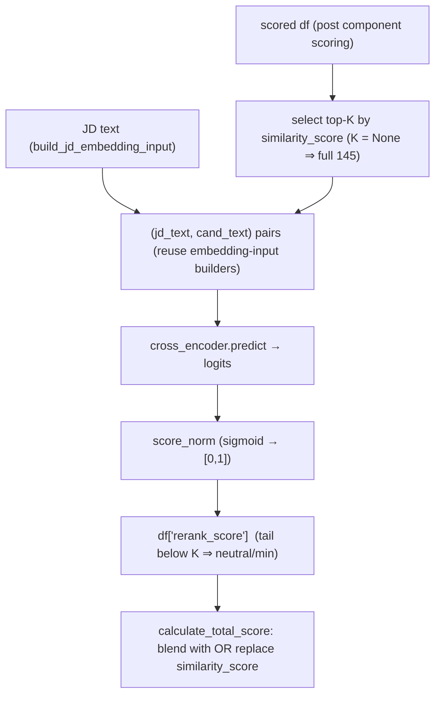

# Spec — Cross-encoder Re-ranker (M1) · Research & Proposed Design

| | |
|---|---|
| **Status** | 📋 **Proposed / researched — NOT implemented (parked)**. No code exists yet; this is a design + findings doc to resume from. |
| **Type** | New `rerank_score` component (retrieve → re-rank) that blends with / replaces `similarity_score` |
| **Backlog** | `docs/BACKLOG.md` → **M1** (Modeling upgrades) |
| **Related** | Superseded-in-priority by the shipped bi-encoder upgrade (`docs/specs/bi-encoder-upgrade.md`); the LLM re-ranker (**M4**) is the later, circularity-blocked cousin |
| **Compute target** | 16 GB Apple M2 Pro (MPS, no CUDA), PyTorch 2.7.1 |

> **Read this first (context):** during this research we **pivoted** to the bi-encoder upgrade
> (`similarity_score`: all-mpnet → Qwen3-Embedding-0.6B) because on a 16 GB M2 Pro any cross-encoder must
> be small anyway, and a strong small bi-encoder was the cheaper, lower-risk first win. The cross-encoder
> remains the recommended **next** modeling step. The isolation/config/builder plumbing built for the
> bi-encoder (`SimilaritySpec`, `build_similarity_spec`, per-model cache, NaN guard, truncation logging)
> is directly reusable here.

---

## 1. Summary

Add a second-stage **cross-encoder re-ranker**: after component scoring, re-score the top-K
`(JD, candidate)` pairs with a model that **jointly attends over the pair** (unlike the bi-encoder, which
embeds each side independently), then blend with or replace the 0.45-weight `similarity_score`. A
cross-encoder captures "this candidate *for this JD*" nuance that independent embeddings miss — the
source of the biggest ranking misses (e.g. harikrishna, only partially recovered by hybrid skills).

## 2. Why the backlog suggested `ms-marco-MiniLM-L-6-v2` — and why to course-correct

The backlog names `cross-encoder/ms-marco-MiniLM-L-6-v2` (canonical id today drops the dashes:
`ms-marco-MiniLM-L6-v2`; the dashed form is an old alias). It is the community-default cross-encoder, and
the numbers explain why (MS MARCO passage ranking, sbert.net):

| model | TREC DL19 NDCG@10 | MS-MARCO MRR@10 | docs/sec (V100) | params | ctx |
|---|---:|---:|---:|---:|---:|
| ms-marco-MiniLM-**L6**-v2 | 74.30 | 39.01 | 1800 | 22.7M | **512** |
| ms-marco-MiniLM-L12-v2 | 74.31 | 39.02 | 960 | ~33M | 512 |

L6 matches L12's quality at ~2× the throughput — the speed/quality sweet spot **for MS MARCO**.

**Course-correction (why it's only a baseline, not the pick):** MiniLM-L6 is trained on **short Bing
queries → web passages**. Our task is a **long JD → a long candidate profile**. Two concrete mismatches:
1. **512-token cap** — truncates the long JD + long profile (the exact problem the bi-encoder upgrade
   just addressed on the retrieval side; see the 44 %-truncation finding in the bi-encoder spec).
2. **Domain** — short keyword-query relevance ≠ professional-document fit.

Since the pool is small (145, title-gated), **latency is not binding**, so a stronger modern
long-context reranker is affordable. Treat model choice as an **ablation on gold NDCG@10** (repo
methodology), not a default.

## 3. Candidate models (researched 2026-07)

Reranker-specific BEIR nDCG@10 + license + interface + fit for a 16 GB MPS box. **BEIR numbers are
cross-source (model cards / MTEB) → directional, not a clean apples-to-apples.**

| model | params | ctx | BEIR | license | interface | verdict |
|---|---:|---:|---:|---|---|---|
| **Alibaba-NLP/gte-reranker-modernbert-base** | 149M | **8192** | 56.73 | **apache-2.0** | drop-in `CrossEncoder` | **recommended primary** — small, long-ctx, commercial-safe, ModernBERT (MPS-safe expected) |
| cross-encoder/ms-marco-MiniLM-L6-v2 | 22M | 512 | — (MS MARCO tuned) | apache-2.0 | drop-in `CrossEncoder` | fast **baseline** ("does a cross-encoder help at all") |
| mxbai-rerank-base-v2 | 0.5B | — | 58.40 | apache-2.0 | extra dep | escalation if gte underwhelms |
| BAAI/bge-reranker-v2-m3 | 0.6B | 8192 | 56.51 | apache-2.0 | `CrossEncoder`/FlagEmbedding | heavier multilingual alt (not needed — English) |
| Qwen3-Reranker-0.6B | 0.6B | — | 56.28 | apache-2.0 | custom | Qwen3-based → **MPS-NaN risk** (see §7) |
| Querit-Reranker-4B (`Querit/Querit-4B`) | 4.0B | 128k | 71.09 (MTEB multiling rerank, **top**) | apache-2.0 | custom (`trust_remote_code`) | **ceiling probe only** — 7.5 GB (tight on 16 GB), Qwen3-Emb-4B backbone → **MPS-NaN risk**, very new |
| ~~jinaai/jina-reranker-v3~~ | 0.6B | 131k | **61.94 (SOTA small)** | **cc-by-nc-4.0** ❌ | custom | **excluded** — non-commercial license blocks a product |
| 7–8B rerankers (e.g. Qwen3-Reranker-8B) | 7–8B | — | higher | apache-2.0 | custom | **excluded** — fp16 weights ≈ 14–16 GB, won't fit alongside the OS on 16 GB |

**MTEB "Reranking" column clarification (learned this session):** the modern MTEB v2 leaderboard **does**
evaluate and **tag** cross-encoders — `Querit/Querit-4B` is a tagged `CROSS-ENCODER` with a Reranking
score (71.09), and `jina-reranker-v3` has one too (67.84). So the leaderboard **filtered to
cross-encoders + English reranking** is a valid candidate-generation tool. Caveat: coverage is
sparse/inconsistent (many rerankers, incl. gte-reranker, are absent from the eng subset), so it
**complements** model-card BEIR; the **final decider is our own gold NDCG@10**.

## 4. Proposed design

- **New scorer** `calculate_rerank_score(df, jd, cross_encoder, top_k=None, score_norm='sigmoid')` in
  `core/scoring.py`. Reuse `build_jd_embedding_input` / `build_candidate_embedding_input` for pair text.
  `top_k=None` → full pool (fine at n=145); `top_k` set → rerank only the top-K by `similarity_score`,
  tail gets a neutral/min sentinel (so the fusion stays well-defined).
- **Reuse the bi-encoder plumbing:** a `RerankSpec` config in `models/mappings.py` + a
  `build_rerank_model()` builder in `core/…` mirroring `build_similarity_spec` (device/dtype/max_seq/
  `trust_remote_code`), plus the **NaN guard** and **per-model score cache** (`.ai-recruiter/rerank_*.pkl`,
  keyed on model + JD + candidate texts).
- **Fusion:** add `rerank_score` to `candidate_score_weights`, active-gated (always-on: it always has
  text). **Blend vs replace `similarity_score` is an open decision** (§6) — decide via the
  `--redundancy rerank_score similarity_score` 2×2.
- **Wiring:** all three entry points (`core/pipeline.py`, `evals/runner.py`, `scripts/run_hr_assistant.py`)
  + `PipelineConfig` (e.g. `rerank_enable`, `rerank_model`, `rerank_top_k`) + `scripts/calibrate_weights.py`
  (`COMP_COLS`/precompute — the rerank score is **config-invariant under soft title**, like the other
  components, so it precomputes once per **model**) + `scripts/run_eval.py` CLI. Tests
  `tests/test_rerank_score.py` (determinism, [0,1], neutral/missing, top-K sentinel, gating).

## 5. Evaluation & the leakage caveat (important)

- **No circularity** (unlike the LLM re-ranker M4): a cross-encoder can be validated on the current eval
  **now**. Decision metric = **gold NDCG@10**.
- **Reverse-match leakage is WORSE for a cross-encoder.** The reverse-match JD is generated from the
  seed's own title/responsibilities/summary; a cross-encoder attends jointly over the pair and will latch
  onto the copied phrasing → inflated seed rank → inflated reverse MRR. **Read any reverse-MRR jump as
  leakage, not quality.** (The bi-encoder already showed a leakage-suspect reverse gain; a cross-encoder
  will amplify it.)
- Adopt-loop: ablate model(s) on gold NDCG@10 → `--redundancy` for blend/replace → weight sweep →
  ratchet floors (honest-anchor only) → regenerate `evals/baseline_linkedin.json` → `pytest` → sanity on
  the real HR JD → docs.

## 6. Open gaps / decisions to make when replanning

> These are deliberately unresolved — fill them during the M1 replan.

1. **Eval blindness (the binding gap).** The honest anchor is **n=1 silver gold** with a **short** JD
   (346 tokens), and reverse-match leakage is **worse** for cross-encoders. So — exactly like the
   bi-encoder — the eval **cannot fairly measure** a cross-encoder's benefit today. **Decision:** gate M1
   on **Tier-0** (human-labeled, longer gold JDs) first, or accept a product-motivated adoption? Recommend
   **gate on Tier-0** (a cross-encoder is a bigger, slower change than the bi-encoder swap, with less
   eval visibility).
2. **Blend vs replace `similarity_score`.** Unknown until the `--redundancy rerank_score similarity_score`
   2×2 is run. Likely redundant (both are JD↔profile relevance) → replace; if complementary → blend.
3. **top-K.** Full pool (145) vs rerank top-K (~30–50) by `similarity_score`. Full pool is tractable at
   n=145 but won't scale; the tail-sentinel policy for `top_k` needs choosing.
4. **Model final pick.** `gte-reranker-modernbert-base` is the recommended primary but **unvalidated on
   our gold**. `Querit-4B` is the quality ceiling but heavy + MPS-risky (§7). Needs the ablation.
5. **Score normalization.** Cross-encoder outputs are **unbounded logits** — sigmoid → [0,1] vs raw vs
   per-pool min-max. Affects how it fuses with the [0,1] components. Undecided.
6. **`rerank_score` weight.** Not tuned. If it *replaces* similarity it inherits ~0.45; if it *blends*,
   the split needs a sweep.
7. **Latency / batching at scale.** O(K) forward passes per JD. Fine for 145 on a base-size model; a 4B
   model (Querit) is slow on MPS and the pattern won't scale to large pools without a real top-K cutoff.
8. **Cross-encoder input text.** Reuse the symmetric `build_*_embedding_input` builders, or craft a
   reranker-specific pair format (some models want a specific template)? Undecided.

## 7. Learnings from the bi-encoder work that carry over

- **MPS NaN risk for custom (Qwen3-based) architectures.** Jasper-600M (Qwen3-Jasper) **NaN'd on MPS in
  every dtype** and even with `PYTORCH_ENABLE_MPS_FALLBACK=1`; it only ran on CPU. **Qwen3-Reranker-0.6B
  and Querit-4B share the Qwen3 lineage → assume the same MPS risk until tested.** `gte-reranker-
  modernbert-base` (ModernBERT) is the safer bet. The **NaN guard** (`core/embedding.py`) already exists
  and should wrap the rerank scores too.
- **Memory management** — cap `max_seq_length` and use fp16 on MPS (fp16 was precision-neutral for the
  bi-encoder: cos 0.513 vs 0.512). A 16 GB box tops out around ~4B (7.5 GB) and only for a one-off probe.
- **Isolation + config pattern** — `similarity_model_config` + `build_similarity_spec` + per-model cache
  + reversible-via-`None` is the template to copy for `rerank`.
- **Truncation logging** — reuse `log_truncation` so an over-cap JD/profile is a visible signal here too.
- **Floors** — ratchet **only** on an honest-anchor gain; a reverse-only gain is leakage (documented as
  EXCEPTIONs in `tests/test_eval_regression.py`).

## See also

- Shipped sibling (retrieval side) → `docs/specs/bi-encoder-upgrade.md`
- Design decisions → `docs/DECISIONS.md` · Open work → `docs/BACKLOG.md` (M1)
- Pipeline state → `docs/PIPELINE.md` · Adopt loop → `AGENTS.md`
