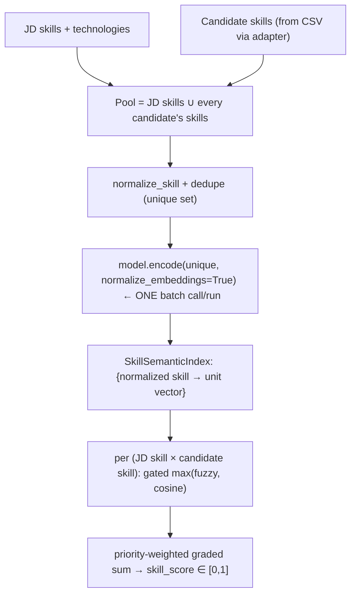

# Spec — Hybrid Skill Matching

| | |
|---|---|
| **Status** | ✅ Shipped (2026-07-11) |
| **Type** | Matcher upgrade inside the existing `skill_score` component (no new component) |
| **Decision** | `docs/DECISIONS.md` → "Skill matching = hybrid" |
| **Tests** | `tests/test_skill_semantic.py` (7) · regression floors in `tests/test_eval_regression.py` |
| **Baseline** | `evals/baseline_linkedin.json` |

---

## 1. Summary

Upgrade the skill matcher from **char-level fuzzy only** to a **hybrid** of fuzzy and
semantic (embedding-cosine) matching, combined as a per-channel **gated max** — mirroring the
title gate. Semantic recovers synonyms and specialised domain terms that the character matcher
is blind to (talent acquisition ↔ recruitment, WPS ↔ wage protection system). Adopted at the
**unchanged** skill weight (0.25) after a strict Pareto win on the eval set.

## 2. Problem

`skill_score` (weight 0.25) was effectively dead. The matcher used `rapidfuzz` character ratio
plus a hand-maintained alias table, so literal skill scores were near-zero on the specialised HR
vocabulary in the real JD (WPS, MOHRE, Bayzat) and on ordinary synonyms. Component diagnosis on
the real JD (`evals/blind_comparison_report.md`) showed strong candidates dragged down purely by a
tiny skill signal:

| candidate | fuzzy skill | pipeline rank | blind fit |
|---|---:|---:|---:|
| harikrishna-r | 0.120 | 51 | 82 |
| abbas-ali-khan | 0.194 | 28 | 74 |
| thereseelizabeth (false +) | 0.230 | 6 | 51 |

Because scores were compressed into `[0, ~0.23]`, the 0.25 nominal weight delivered a fraction of
its intended influence.

## 3. Goals / Non-goals

**Goals**
- Recover synonym / domain-term skill matches the fuzzy matcher misses.
- Keep the change **behind a knob** and **backward compatible** (fuzzy stays the default of the
  low-level scorer; all pre-existing tests pass unchanged).
- Adopt only if it **holds or improves gold NDCG@10** and clears every regression floor.

**Non-goals**
- No new scoring component, no weight re-tuning (matcher-only change).
- Not a cross-encoder / re-ranker (that is a separate backlog item; hybrid skills only partially
  recovers e.g. harikrishna).
- No per-candidate embedding persistence (the skill index is rebuilt per run; it is cheap).

## 4. Design

### Overview



### Per-pair match strength (`core/matching.py` → `weighted_fuzzy_skill_score._match_strength`)

For a (JD skill, candidate skill) pair, both scores are put on a common `[0,1]` scale and each is
**gated by its own floor before** the max:

```
fuzzy_channel    = fuzzy_ratio / 100      if fuzzy_ratio >= score_threshold (70)   else 0
semantic_channel = cosine                 if cosine      >= semantic_threshold (0.40) else 0
strength         = max(fuzzy_channel, semantic_channel)          # ∈ [0,1]
```

Per JD skill, `strength` is maxed over the candidate's skills; the winning `strength` is credited
**graded** and **priority-weighted** (`essential 1.0 / important 0.7 / valuable 0.4 /
supplementary 0.2`), then divided by the total possible weight → `skill_score ∈ [0,1]`. This
graded, priority-weighted accumulation is unchanged from the fuzzy version; only the per-pair
strength gained a semantic channel.

### Semantic index (`core/skill_normalization.py`)

- `build_skill_semantic_index(skills, model)` — normalizes + **dedupes** the union of JD +
  candidate skills to the unique set, then does **one** `model.encode(..., normalize_embeddings=True)`
  batch call. Returns `SkillSemanticIndex`, a dict `{normalized_skill → unit vector}`.
- `SkillSemanticIndex.similarity(a, b)` — looks up two precomputed unit vectors and returns their
  dot product (= cosine, since unit-normalized); `0.0` if either skill is unknown.

**Runtime characteristics:** generated in-process per run (like the title matcher), **not** persisted
to disk (unlike whole-profile embeddings in `.ai-recruiter/emb_*.pkl`). Dedup means a skill shared by
N candidates is encoded once, so the per-candidate loop is pure vector lookups — no model calls
inside the loop. Cost is a single batch of a few hundred short strings (< 1s).

### Configuration knobs

| knob | where | default | meaning |
|---|---|---|---|
| `skill_mode` | scorer paths (`calculate_skill_score`, `PipelineConfig`, `run_pipeline`) | `hybrid` at entry points; `fuzzy` on the low-level `calculate_skill_score` | `fuzzy` \| `semantic` \| `hybrid` |
| `skill_semantic_threshold` | `models/mappings.py` | `0.40` | semantic cosine floor |
| `score_threshold` (fuzzy floor) | `weighted_fuzzy_skill_score` | `70` | fuzzy char-ratio floor |

`skill_mode` resolves to matcher behavior via two flags passed into `weighted_fuzzy_skill_score`:
`fuzzy` → `semantic_index=None` (semantic branch skipped); `semantic` → `include_fuzzy=False`
(fuzzy branch skipped); `hybrid` → both active.

### Why a *gated* max, not title's *direct* max

The title gate ([core/filtering.py](../../core/filtering.py)) does a raw `np.maximum(fuzzy, cosine)`
with no floors — fine, because title emits **one** soft score. Skills instead **accumulate** many
partial matches (one per JD requirement), and cosine is rarely near zero for same-domain words. An
ungated max would let every JD skill collect ~0.2–0.3 of spurious credit from *some* candidate skill,
inflating `skill_score` toward a common baseline and destroying discrimination. The per-channel floor
turns each pair into a match / not-match decision, so only genuine matches accrue. The two floors also
differ (0.70 fuzzy vs 0.40 semantic) because the two scores have different distributions — a single
direct max cannot express that.

## 5. Integration points

| file | change |
|---|---|
| `models/mappings.py` | `skill_semantic_threshold = 0.40` |
| `core/skill_normalization.py` | `SkillSemanticIndex` + `build_skill_semantic_index` |
| `core/matching.py` | `weighted_fuzzy_skill_score`: `_match_strength` gated-max + `semantic_index` / `semantic_threshold` / `include_fuzzy` params |
| `core/scoring.py` | `calculate_skill_score`: `model` / `skill_mode` / `semantic_threshold`, builds the index once per call |
| `core/pipeline.py` | `run_pipeline`: `skill_mode` (default `hybrid`) threaded to the scorer |
| `evals/runner.py` | `PipelineConfig.skill_mode='hybrid'` + `rank_candidates` wiring |
| `scripts/calibrate_weights.py` | `--skill-mode` / `--skill-semantic-threshold`; `precompute_components` re-runs per skill config |
| `scripts/run_eval.py` | `--skill-mode` CLI |
| `scripts/run_hr_assistant.py` | `score_pool` uses `skill_mode="hybrid"` |
| `tests/test_skill_semantic.py` | 7 new tests (deterministic core + one real-model synonym check) |
| `tests/test_eval_regression.py` | `CHAMPION_CONFIG` → `skill_mode="hybrid"`; floors ratcheted |

## 6. Backward compatibility

The low-level `calculate_skill_score` and `weighted_fuzzy_skill_score` default to **fuzzy**
(`semantic_index=None`), so behavior is byte-identical until an entry point opts into hybrid — the
same pattern as `title_mode` (the `filter_by_job_title` default is `fuzzy`; the champion hybrid lives
at the entry points). All pre-existing tests pass unchanged; the suite is **85 pass** (78 + 7).

## 7. Evaluation & methodology

Followed the repo's ablate-then-adopt loop (`AGENTS.md`). Decision metric = **gold NDCG@10**
(leakage-free anchor); reverse-match MRR is secondary/noisy.

```bash
# offline skill-matcher ablation (no LLM): sweep skill weight under each mode/threshold
uv run python scripts/calibrate_weights.py --n-per-group 5 \
    --skill-mode hybrid --skill-semantic-threshold 0.40 \
    --ablate skill_score --ablate-grid 0.05 0.15 0.25 0.35 0.45

# regenerate baseline with the adopted config
COPILOT_SKIP_CLI_DOWNLOAD=1 uv run python scripts/run_eval.py \
    --dataset linkedin --n-per-group 5 --out evals/baseline_linkedin.json

# full offline suite (78 + 7)
COPILOT_SKIP_CLI_DOWNLOAD=1 uv run pytest tests -q --ignore=tests/test_eval_pipeline.py
```

### Threshold selection

`all-mpnet-base-v2` compresses skill-phrase cosine — genuine synonyms land at **~0.45**
(talent acquisition ↔ recruitment = 0.453), not the ~0.7 one might expect. Sweep at skill weight 0.25:

| threshold | gold NDCG@10 | reverse MRR | note |
|---|---:|---:|---|
| fuzzy (baseline) | 0.6288 | 0.3386 | |
| hybrid @0.35 | 0.6354 | 0.3906 | |
| **hybrid @0.40** | **0.6334** | **0.4150** | **adopted** |
| hybrid @0.50 | 0.5940 | 0.3831 | ❌ below gold floor — keeps noisy 0.5–0.6 pairs, drops the genuine ~0.45 synonyms |

0.40 holds gold and maximizes the secondary reverse metrics; 0.50 breaks the gold floor, so the floor
is kept deliberately low.

## 8. Results

Committed eval set (n = 20: 19 reverse-match + 1 gold), skill weight held at 0.25 — **strict Pareto
win, no metric regressed**:

| metric | fuzzy | hybrid | Δ |
|---|---:|---:|---:|
| gold NDCG@10 | 0.6288 | **0.6334** | +0.005 |
| gold NDCG@5 | 0.5582 | **0.6165** | +0.058 |
| reverse MRR | 0.3386 | **0.4150** | +0.076 |
| hit@1 | 0.2105 | **0.3158** | +0.105 |
| hit@10 | 0.6316 | **0.6842** | +0.053 |
| hit@3 / hit@5 | 0.4211 / 0.4737 | 0.4211 / 0.4737 | 0 |
| seed_found_rate | 1.0 | 1.0 | 0 |

Real JD (145 candidates) — hybrid recovered the skill-starved strong candidates and demoted a
surface-match false positive:

| candidate | fuzzy skill / rank | hybrid skill / rank | blind fit |
|---|---|---|---:|
| harikrishna-r | 0.12 / 51 | 0.34 / **33** | 82 |
| amulya-dattada | 0.17 / 17 | 0.69 / **6** | 75 |
| abbas-ali-khan | 0.19 / 28 | 0.43 / **20** | 74 |
| thereseelizabeth (false +) | 0.23 / **6** | 0.45 / **14 ↓** | 51 |

### Regression floors ratcheted (`tests/test_eval_regression.py`)

`mrr` 0.33 → **0.41**, `hit@10` 0.63 → **0.68**, `ndcg@10` 0.62 → **0.63** (others held).

## 9. Follow-ups

- **Revisit `skill_semantic_threshold` and skill weight when the gold set expands** (Tier 0). Both are
  tuned on the n = 1 gold; the sweep hinted gold peaks at a *lower* skill weight, but that is
  within-noise on n = 1, so weight was left at 0.25.
- **Re-run the blind adjudication** under hybrid skills — `evals/blind_comparison_report.md` predates
  this change (tracked in `docs/BACKLOG.md`).
- **Cross-encoder re-ranker** remains the next lever for the candidates hybrid skills only partially
  recovers (e.g. harikrishna still #33 vs blind-consensus #1).
- **Optional:** persist the skill index to disk (content-hash cache) if the pool ever grows large;
  currently not worth it.

## 10. References

- Decision & rationale: `docs/DECISIONS.md`
- Backlog entry: `docs/BACKLOG.md` → Shipped
- Component diagnosis that motivated it: `evals/blind_comparison_report.md`
- Improvement journey: `evals/pipeline_improvement_report.md`
