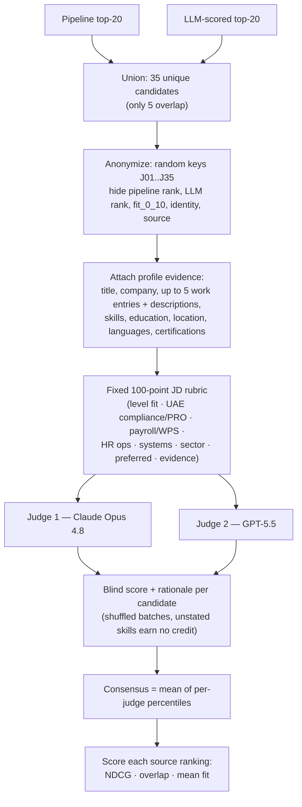
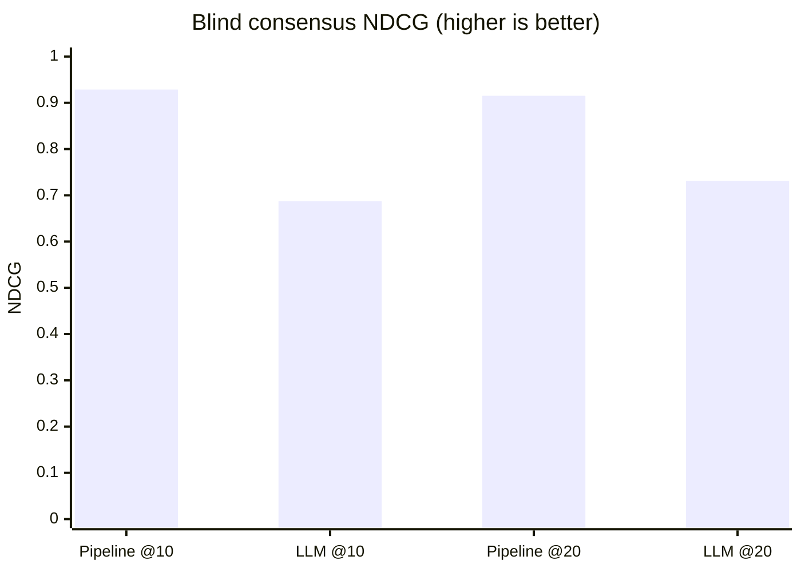
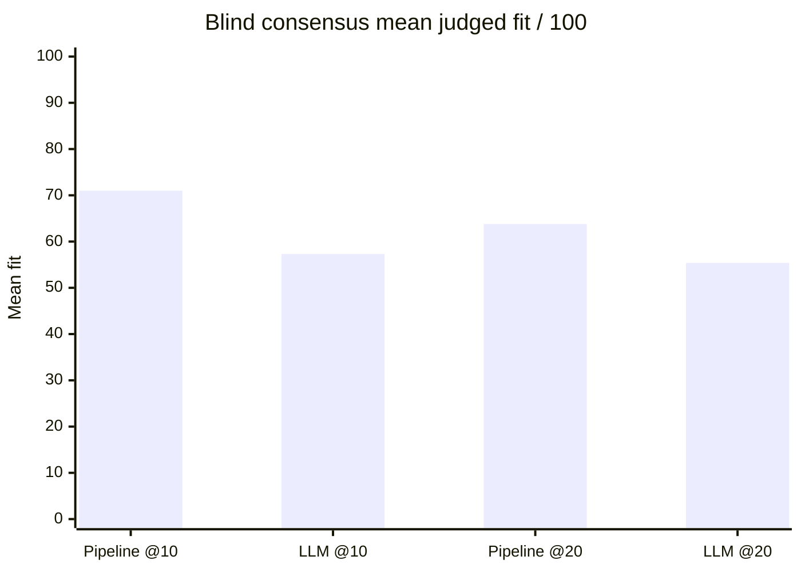

# Blind Shortlist Adjudication — Pipeline vs. LLM-Scored Pool

**JD:** `jd/HR Assistant — Prime Focus Group (Prime AC).md`
**Pool:** 145 LinkedIn candidates
**Date:** 2026-07-11

> ⚠️ **This is a *silver* LLM adjudication, not human ground truth.** Two strong models
> judged the candidates blindly against explicit profile evidence. It is a much stronger
> test than asking one model to inspect two labelled lists, but the "truth" is still model
> opinion. Human labels remain the real validation (see the roadmap in `ARCHITECTURE.md`).

---

## TL;DR

**For this JD, the pipeline's top-10/top-20 shortlist is substantially more aligned with the
job requirements than the original LLM-scored (`Scored_FullPool`) shortlist** — and this held
independently for *both* blind judges (they agreed at Spearman **0.959**).

| Blind consensus metric | 🟢 Pipeline | 🔵 LLM-scored |
|---|---:|---:|
| NDCG@10 | **0.9286** | 0.6874 |
| NDCG@20 | **0.9152** | 0.7313 |
| Top-10 overlap w/ consensus | **6 / 10** | 3 / 10 |
| Top-20 overlap w/ consensus | **15 / 20** | 10 / 20 |
| Mean judged fit, top-10 | **71.0 / 100** | 57.3 / 100 |
| Mean judged fit, top-20 | **63.8 / 100** | 55.4 / 100 |
| "Qualified" (≥60), top-10 | **9 / 10** | 6 / 10 |
| "Strong" (≥75), top-10 | **4 / 10** | 2 / 10 |

---

## Method



**Blindness guarantees:** judges never saw which list a candidate came from, the pipeline
rank, the LLM rank, the original `fit_0_10`, or the real name. Keys were random and shuffled
per judge. Both judges scored the *same* 35 candidates, so neither shortlist got a
selection advantage.





## Judge robustness (not driven by one model)

| Judge | Pipeline NDCG@10 | LLM NDCG@10 | Pipeline mean fit@10 | LLM mean fit@10 |
|---|---:|---:|---:|---:|
| Claude Opus 4.8 | 0.9303 | 0.6883 | 67.7 | 54.8 |
| GPT-5.5 | 0.9236 | 0.6841 | 74.3 | 59.8 |
| **Consensus** | **0.9286** | **0.6874** | **71.0** | **57.3** |

Inter-judge rank agreement across all 35 candidates: **Spearman 0.959**.

---

## Blind-consensus top-20

`consensus_rank` is by average percentile across the two judges (robust to each judge's
scale); `score` is the mean raw fit.

| # | Candidate | Title | Score | Pipeline rank | LLM rank |
|---:|---|---|---:|---:|---:|
| 1 | harikrishna-r | HR Officer - Group Operations | 82.0 | 51 | **4** |
| 2 | muhammed-ashar-k | Human Resources Assistant | 81.5 | **4** | 54 |
| 3 | megha-p-s | HR Executive | 78.5 | **11** | 25 |
| 4 | aiswarya-ravindran | HR operation assistant | 78.0 | **1** | 34 |
| 4 | savaf-methiyil | Human Resources Assistant | 78.0 | **3** | 39 |
| 6 | sabeeh-ansari | HR and Administrative Executive | 77.5 | 10 | 5 |
| 7 | amulya-dattada | HR Operations Executive | 75.0 | **17** | 42 |
| 8 | samasthasunoj | HR Assistant & Document Controller | 73.5 | **2** | 20 |
| 9 | abbas-ali-khan | HR Coordinator/Welfare Officer | 74.0 | 28 | **2** |
| 10 | arunmania | Regional Assistant - HR | 70.5 | **5** | 37 |
| 11 | sufiyan-malik | HR / Labor Relations Officer | 69.5 | 61 | **7** |
| 12 | fathimath-farhana | HR Executive | 69.0 | **8** | 19 |
| 13 | yoosuf-chamathadka | PRO Executive – HR Assistant | 68.0 | 9 | 13 |
| 14 | mariam-khalid | Human Resources Assistant | 66.5 | 12 | 12 |
| 15 | akhila-s-joseph | Human Resources Executive | 63.0 | **7** | 122 |
| 15 | minahil-farooq | HR Assistant | 63.0 | **14** | 92 |
| 17 | leena-e | HR Executive | 62.5 | **16** | 102 |
| 18 | abiya-prince | HR & Admin Officer | 62.0 | 32 | **8** |
| 19 | amrutha-k-k | HR and Administration Officer | 62.0 | 22 | **6** |
| 20 | alyazyeh-a | Sr. Associate Officer - HR | 57.5 | **13** | 124 |

---

## Why the pipeline won

Candidates the pipeline surfaced but the LLM ranking buried — all with **concrete**
payroll / visa / HRIS / sector evidence:

| Candidate | Blind fit | Pipeline | LLM |
|---|---:|---:|---:|
| muhammed-ashar-k | 81.5 | 4 | 54 |
| aiswarya-ravindran | 78.0 | 1 | 34 |
| savaf-methiyil | 78.0 | 3 | 39 |
| amulya-dattada | 75.0 | 17 | 42 |

The original LLM ranking, by contrast, put **under-evidenced** candidates at the very top:

| Candidate | Blind fit | Pipeline | LLM | Evidence in raw profile |
|---|---:|---:|---:|---|
| che-ibardelosa | **26.5** | 111 | **1** | Title "HR Assistant" + prior "Payroll Staff"; 4 generic skills; **no descriptions, no languages, no about** |
| anandhu-s | **26.0** | 104 | **3** | Concrete-manufacturer employer + assistant title; **no HR/compliance/payroll evidence** |
| devikaaneesh | 40.5 | 92 | 10 | Relevant title/sector; sparse role descriptions |

The original grader's stated reasons for its #1 (e.g. Tagalog, "UAE labour/payroll admin,
bullseye level fit") are **not supported by the candidate's raw profile** — those signals
are absent. The evidence-grounded blind judges correctly declined to credit unstated skills.

## Where the LLM ranking was better (real pipeline gaps)

| Candidate | Blind fit | Pipeline | LLM | Why the pipeline missed |
|---|---:|---:|---:|---|
| harikrishna-r | **82.0** | 51 | 4 | Rich manufacturing + 140-worker + MOHRE/GDRFA/payroll evidence, but **title 0.61 / skill 0.12** dragged it down despite similarity 0.83 |
| abbas-ali-khan | 74.0 | 28 | 2 | Strong construction/blue-collar HR; literal skill match low |
| sufiyan-malik | 69.5 | 61 | 7 | Deep PRO/visa/portal evidence; narrow skill overlap |

And a pipeline **false positive**:

| Candidate | Blind fit | Pipeline | Why over-ranked |
|---|---:|---:|---|
| thereseelizabeth | 51.0 (consensus #23) | **6** | Perfect **title 1.0 + seniority 1.0 + experience 1.0**, but hospitality-only background with **no UAE compliance / payroll / PRO** evidence |

### Component diagnosis (from `evals/results/pipeline_run_hr_assistant.csv`)

| Candidate | total | title | skill | seniority | experience | similarity | rank |
|---|---:|---:|---:|---:|---:|---:|---:|
| harikrishna-r (missed) | 0.610 | 0.608 | 0.120 | 0.75 | 0.94 | 0.831 | 51 |
| abbas-ali-khan (missed) | 0.645 | 0.697 | 0.194 | 1.00 | 0.93 | 0.795 | 28 |
| thereseelizabeth (false +) | 0.697 | 1.000 | 0.230 | 1.00 | 1.00 | 0.721 | 6 |
| che-ibardelosa (correctly low) | 0.513 | 0.901 | 0.000 | 1.00 | 0.97 | 0.478 | 111 |

**Read:** literal `skill_score` is tiny across the board (fuzzy matching can't match the JD's
specialised terms — WPS, MOHRE, Bayzat — to candidate wording), and `title_score` +
`seniority`/`experience` can inflate weak candidates (Therese). This is precisely the case for
a **cross-encoder re-ranker** (to recover Harikrishna) and **semantic skill matching** (to fix
the skill signal) — see the roadmap in `ARCHITECTURE.md`.

---

## Artifacts & reproduction

- Full blind scores + both judges' rationales: `evals/judgments/blind_judgments_hr_assistant.csv`
- Machine-readable summary + consensus top-20: `evals/judgments/blind_ranking_comparison_hr_assistant.json`
- Pipeline ranking of all 145: `evals/results/pipeline_run_hr_assistant.csv`
- Pipeline ⋈ original LLM scores: `evals/results/pipeline_vs_llm_hr_assistant.csv`

```bash
# reproduce the pipeline run + the raw pipeline-vs-LLM comparison
COPILOT_SKIP_CLI_DOWNLOAD=1 uv run python scripts/run_hr_assistant.py
# reproduce the blind two-judge adjudication (live Copilot calls)
uv run python scripts/blind_judge_rankings.py --batch-size 5 --retries 2
```

### Bottom line

The pipeline produces the better top-10/top-20 **by a wide margin**, mainly because it avoids
the original grader's under-evidenced picks. But the LLM ranking still catches a few genuinely
strong candidates the pipeline misses — so the right next step is **not** to replace the
pipeline with an LLM ranker, but to keep the pipeline as retrieval and add an evidence-grounded
re-ranker on top.
