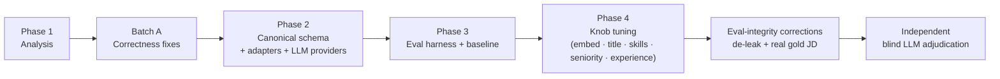
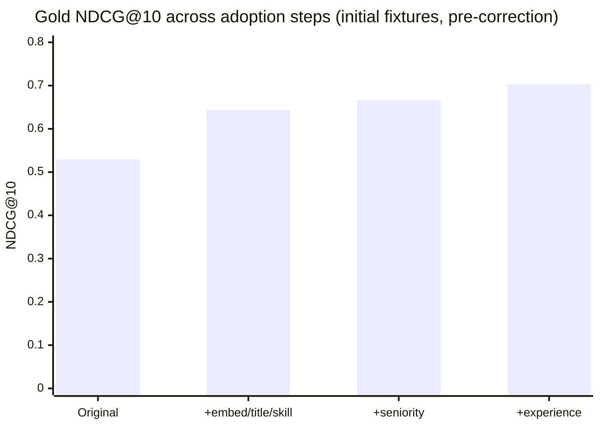
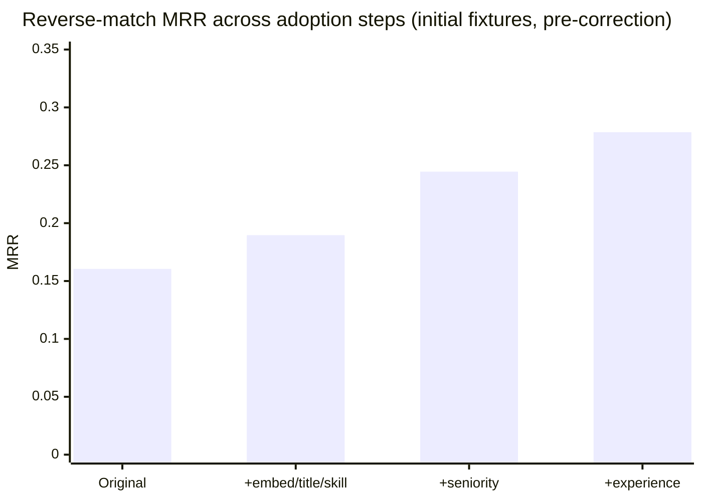
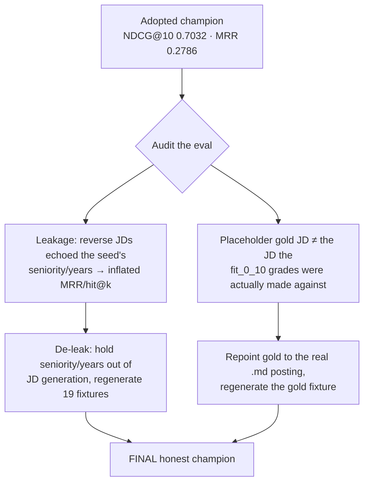

# Pipeline Improvement Journey — Baseline → Champion

**Goal:** rebuild a candidate scoring/filtration pipeline for accuracy, backed by an evaluation
harness that can gauge (and regression-guard) that accuracy.
**Dataset:** LinkedIn HR-Assistant pool (145 candidates) + one graded gold JD.

> **How to read the numbers:** the evaluation itself was hardened *during* the project (leakage
> removed, gold JD corrected). So numbers are grouped by **measurement regime**. Improvements
> were *adopted* under the early regime; the **final honest numbers** are lower not because the
> pipeline regressed, but because the *yardstick got more honest*. This is called out explicitly
> below.

---

## The journey at a glance

---

## Metrics considered

Two complementary signals were used, with very different trust levels:

| Metric | Type | Source | What it means |
|---|---|---|---|
| **hit@k** | binary | reverse-match | Does the seed candidate appear in the top-k? |
| **MRR** | binary | reverse-match | 1 / rank of the seed (higher = seed ranked higher). |
| **seed_found_rate** | binary | reverse-match | Is the seed anywhere in the ranking (gate didn't drop it)? |
| **NDCG@k** | graded | gold JD | Agreement with graded relevance `fit_0_10` (ranking quality). |
| **Spearman / Kendall** | rank corr | LLM-scored pool | Agreement of full rankings (used for the LLM comparison). |
| **Blind consensus fit** | graded | 2 blind judges | Independent, evidence-grounded shortlist quality. |

**Two eval substrates:**
- **Reverse-match** (primary knob-tuner): generate a JD from a seed profile, expect the seed to
  rank high. Cheap and repeatable, but **leakage-prone** → treated as a *secondary/noisy* signal.
- **Gold case** (honest anchor): a real JD with graded relevance. **Leakage-free** but *silver*
  (LLM/rubric-graded) and **n = 1**.

**Regression ratchet:** `tests/test_eval_regression.py` holds metric *floors* that only move up
when an improvement is adopted, so no change can silently regress the eval.

---

## Baseline: what was broken (Phase 1)

The original pipeline was `title(0.25) + skill(0.25) + qualification(0.05) + similarity(0.45)`
with uncalibrated weights and several correctness issues:

- **Degenerate embedding** — the candidate vector used a field that was identical across every
  candidate in a job title, so the 0.45-weight semantic signal added *no within-role
  discrimination*.
- **Hard title gate** — a brittle fuzzy cutoff dropped relevant candidates (e.g. "HR Executive"
  for an "HR Assistant" JD).
- **Binary skill match** — fuzzy ≥ 80 → full credit else 0 (cliff), with synonym-blind matching
  and no aliases.
- **Unused signals** — seniority, experience, location, etc. extracted but never scored.
- **Thin eval** — a single network-dependent test, no metrics, no baseline.

---

## Phase 4 adoption steps (measured on the *initial* eval fixtures)

> Regime: **initial reverse-match fixtures + placeholder gold JD**. Consistent within this block,
> so the deltas are comparable. (These are the numbers each change was *adopted* on.)

| Stage | Change | MRR | hit@3 | hit@5 | hit@10 | NDCG@10 |
|---|---|---:|---:|---:|---:|---:|
| **Original** | uncalibrated baseline | 0.1605 | 0.1053 | 0.1579 | 0.5263 | 0.5295 |
| **4.1–4.2** | embedding enrichment + soft hybrid title + normalized/graded skills | 0.1896 | 0.2632 | 0.3684 | 0.5263 | 0.6441 |
| **4a** | + `seniority_score` (0.05) | 0.2445 | 0.2632 | 0.4211 | 0.6316 | 0.6664 |
| **4b** | + `experience_score` (0.05) | 0.2786 | 0.4211 | 0.4737 | 0.6842 | 0.7032 |

### What each knob did

| Knob | Effect |
|---|---|
| **Embedding enrichment (5.1)** | Added skills to the candidate embedding, fixing the degenerate (no within-role discrimination) semantic vector. |
| **Soft hybrid title gate** | Title score = `max(fuzzy, semantic)`, no hard drop → recovers "HR Executive"-type matches (fuzzy gate kept 65% of the pool → hybrid keeps 99%). |
| **Skill normalization + graded contribution** | Aliases (HR↔human resources, MS Excel↔microsoft excel…), casefolding, UK/US spelling, and graded credit above a fuzzy floor instead of a binary cliff. Guards against false positives (Java ≠ JavaScript). |
| **`seniority_score` (0.05)** | Ordinal level match (entry<mid<senior<executive<c_level), under-qualification penalized more than over. |
| **`experience_score` (0.05)** | Years-of-experience fit vs the JD range, gentle over-qualification penalty. |
| **Component normalization** | Tested (min-max per component) and **rejected** — it hurt NDCG@10 (0.7032→0.6657) and hit@10 badly. Kept **off**. |

**Weights:** the joint 6-component sweep (4,096 configs) confirmed the champion core
`0.25 / 0.25 / 0.05 / 0.45` was already near-optimal on the honest signal; higher-MRR configs
were leakage traps. Seniority/experience kept at a deliberately small 0.05 each.

---

## Eval-integrity corrections (the honest reckoning)

Two problems in the *evaluation* were found and fixed. Neither changed the pipeline — they
changed what the numbers *mean*.

| Correction | Effect on the numbers |
|---|---|
| **De-leak** (held seniority/years out of JD generation) | Reverse metrics dropped to honest levels: MRR 0.2786→**0.2434**, hit@3 0.4211→**0.2105**, hit@5→**0.2632**, hit@10→**0.5789**. Gold NDCG unaffected (gold isn't reverse-matched). |
| **Gold JD corrected** (placeholder `.txt` → real `.md` the grades were made against) | Gold NDCG@10 0.7032→**0.6020**, NDCG@5→0.5631. The placeholder was *flattering* the pipeline. |

### Final honest champion

**Weights:** `title 0.25 · skill 0.25 · qualification 0.05 · similarity 0.45 · seniority 0.05 · experience 0.05`
(renormalized when a component is inactive for a JD; hybrid + soft title; normalization off).

| Signal | Metric | Value |
|---|---|---:|
| Reverse-match (de-leaked) | MRR | 0.2434 |
| | hit@1 / hit@3 / hit@5 / hit@10 | 0.1579 / 0.2105 / 0.2632 / 0.5789 |
| | seed_found_rate | 1.0 |
| Gold (real JD, silver, n=1) | NDCG@5 / NDCG@10 | 0.5631 / 0.6020 |

Regression floors are pinned to these honest values (`tests/test_eval_regression.py`), with the
two corrections documented as one-time methodology resets (not ratchet-downs).

---

## Independent validation (the real-world check)

Because the gold set is silver and n=1, the champion was finally stress-tested by a **blind
two-judge adjudication** of the pipeline's top-20 vs. the original LLM-scored top-20 on the real
JD (see `evals/blind_comparison_report.md`):

| Blind consensus | Pipeline | LLM-scored |
|---|---:|---:|
| NDCG@10 | **0.9286** | 0.6874 |
| NDCG@20 | **0.9152** | 0.7313 |
| Mean judged fit @10 | **71.0** | 57.3 |

→ On explicit JD evidence, the pipeline's shortlist is **substantially better aligned** than the
original LLM ranking (judges agreed at Spearman 0.959).

---

## What's next (open levers, in `ARCHITECTURE.md`)

1. **Expand the gold set with human labels** — the single biggest eval-trust lever (n=1 → n>1).
2. **Cross-encoder re-ranker** — recover strong candidates the bi-encoder + fuzzy skills miss
   (e.g. Harikrishna, ranked 51 by the pipeline but #1 by blind consensus).
3. **Semantic skill matching** — the literal skill score is near-zero on specialised JD terms.
4. **LLM re-ranker** — highest ceiling, but gated behind human labels (circularity).

### Files

- Baseline / champion metrics snapshot: `evals/results/baseline_linkedin.json`
- Real 145-candidate run: `evals/results/pipeline_run_hr_assistant.csv`
- Blind adjudication: `evals/reports/blind_comparison_report.md`
- Weight-calibration tool: `scripts/calibrate_weights.py` (`--ablate`, `--redundancy`, `--joint`)
- Eval harness: `evals/` + `scripts/run_eval.py`
